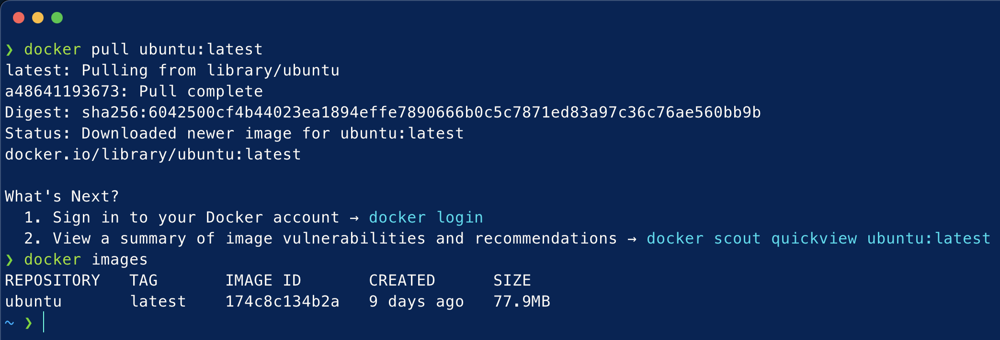
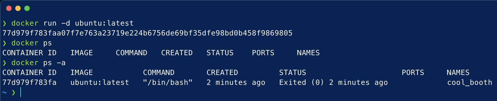
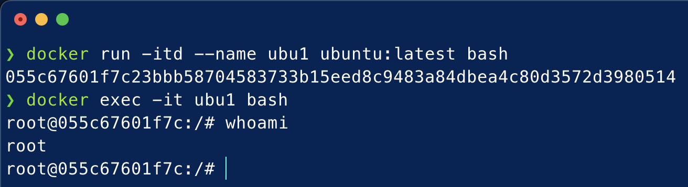
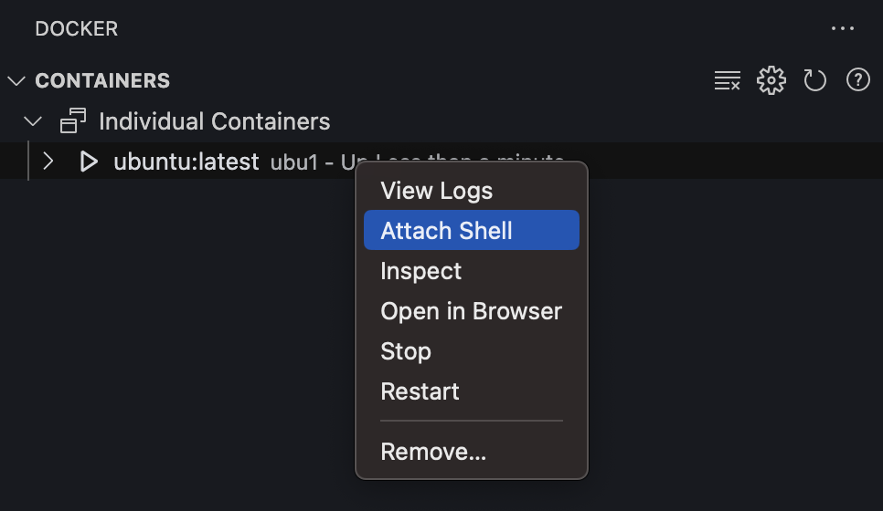
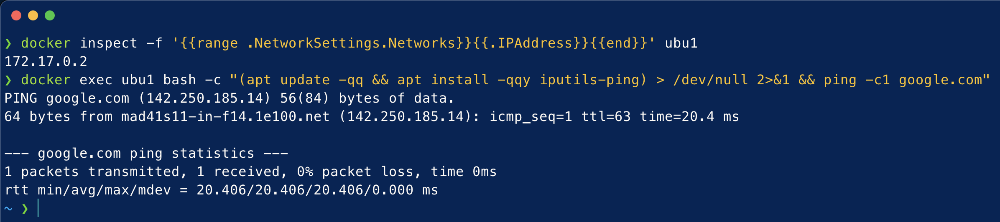
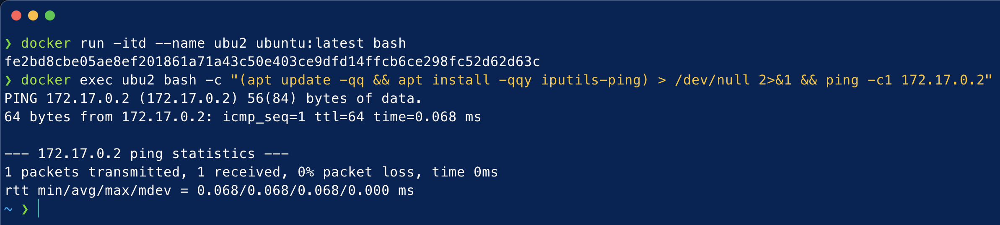
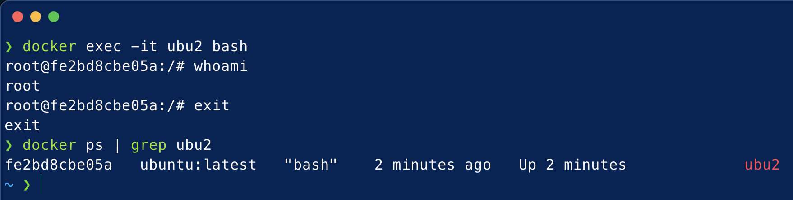
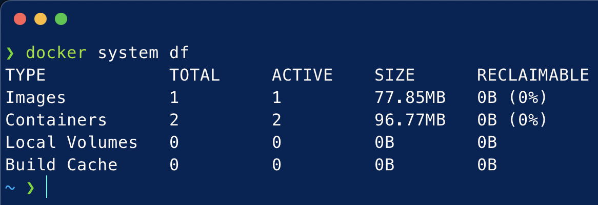
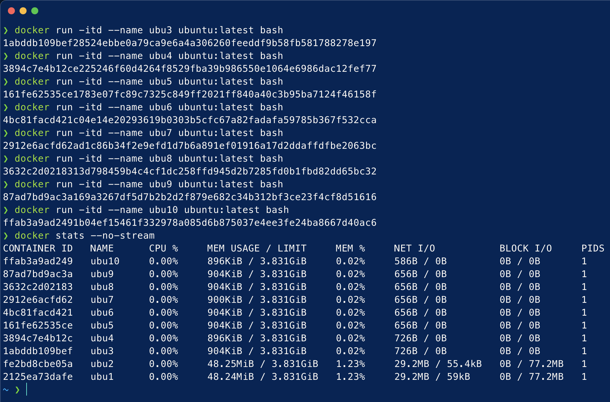

# Docker - Comandos básicos

La siguiente práctica es una lista de tareas que tenéis que hacer. Por cada tarea tenéis que ir poniendo los comandos utilizados y, brevemente, describir el proceso.

Utilizaremos la imagen de Ubuntu (la última). Usa Visual Studio Code y Docker junto con esta imagen para seguir las siguientes instrucciones:

### a) Descarga la imagen `ubuntu:latest` y comprueba que está en tu equipo:
Mediante el comando:
```console
docker pull ubuntu:latest
```
procederemos a descargarnos en nuestro equipo la última versión de la imagen `ubuntu`. 

Una vez descargada dicha imagen, con el comando:
```console
docker images
```
listaremos las imágenes descargas en nuestro equipo.



### b) Crea un `contenedor` sin ponerle nombre. ¿está arrancado? Obtén el nombre:
Mediante el comando:
```console
docker run -d ubuntu:latest
```
procederemos a crear un contenedor sin nombre usando la imagen descargada en el paso anterior y ejecutándose en segundo plano.

Una vez creado dicho contenedor, con el comando:
```console
docker ps
```
podremos visualizar los contenedores en activo en nuestro equipo. En este caso, dado que por defecto la imagen `ubuntu` ejecuta el comando /bin/bash y después cierra el contenedor, nuestro contenedor recién creado no aparecerá en la lista. Para poder visualizarlo aún estando inactivo, deberemos usar el comando:
```console
docker ps -a 
```


### c) Crea un contenedor con el nombre `ubu1`. ¿Como puedes acceder a él?
Mediante el comando:
```console
docker run -itd --name ubu1 ubuntu:latest bash
```
procederemos a crear un contenedor nombrado `ubu1` que ejecutará una shell interactiva en segundo plano, evitando así la parada de dicho contenedor.

Una vez creado el contenedor, tendremos dos vías de acceso a dicho contenedor:

* La primera opción sería mediante la ejecución del comando:
```console
docker exec -it ubu1 bash
```
donde de forma interactiva podremos ejecutar un shell `bash` dentro del conntenedor.



* La segunda opción sería mediante el uso de la opción `Attach Shell` que la extensión `Docker` de Visual Studio Code nos ofrece, la cuál nos ejecutaría dicha terminal bash de forma interactiva en la terminal integrada del editor:



### d) Comprueba que `ip` tiene y si puedes hacer un ping a `google.com`
Mediante el comando:
```console
docker inspect -f '{{range .NetworkSettings.Networks}}{{.IPAddress}}{{end}}' ubu1
```
podremos visualizar la dirección IPv4 del contenedor `ubu1`.

A continuación, con el comando:
```console
docker exec ubu1 bash -c "(apt update -qq && apt install -qqy iputils-ping) > /dev/null 2>&1 && ping -c1 google.com"
```
procederemos a realizar un ping al dominio `google.com` sin entrar dentro del contenedor, comprobando así la gran utilidad de la opción `exec` de docker.



### e) Crea un contenedor con el nombre `ubu2`. ¿Puedes hacer ping entre los contenedores?
Mediante el comando:
```console
docker run -itd --name ubu2 ubuntu:latest bash
```
procederemos a crear el contenedor `ubu2`.

Una vez creado dicho contenedor, con el comando:
```console
docker exec ubu2 bash -c "(apt update -qq && apt install -qqy iputils-ping) > /dev/null 2>&1 && ping -c1 172.17.0.2"
```
realizaremos un ping a la dirección IPv4 del contenedor `ubu1`.



### f) Sal del terminal, ¿que ocurrió con el contenedor?
Mediante el comando:
```console
docker exec -it ubu2 bash
```
proceremos a ejecutar una terminal interactiva dentro del contenedor `ubu2`.

Una vez dentro de dicha terminal, con el comando:
```console
exit
```
saldremos de dicha terminal. 

A continuación, a través del comando:
```console
docker ps | grep 'ubu2'
```
podremos comprobar que, a pesar de haber salido del contenedor `ubu2`, este sigue en activo.



### g) ¿Cuanta memoria en el disco duro ocupaste? ¿Hay alguna herramienta de docker para calcularlo?
Mediante el comando:
```console
docker system df
```
podremos visualizar la cantidad de almacenamiento ocupada tanto por nuestras imágenes, contenedores, volúmenes locales o cachés.



### h) ¿Cuanta RAM ocupan los contenedores? Crea cuantos contenedores necesites para calcularlo.
Trás haber creado contenedores adicionales, mediante el comando:
```console
docker stats --no-stream
```
podremos visualizar en tiempo real la cantidad de memoria RAM utilizada por nuestro contenedores. Nótese la poca memoria RAM del equipo usada por nuestros contenedores (un máximo de un 1.23% de la memoria RAM del equipo).


