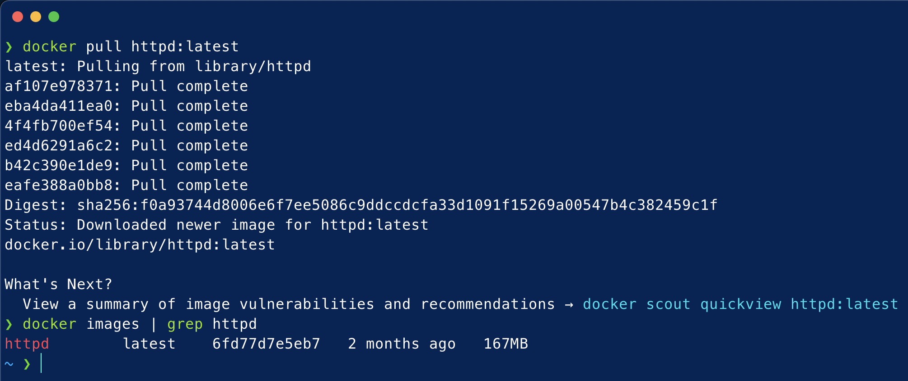
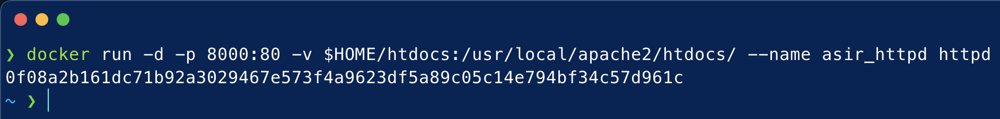
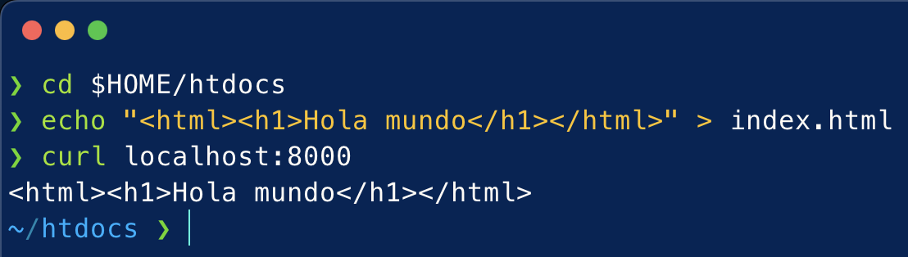
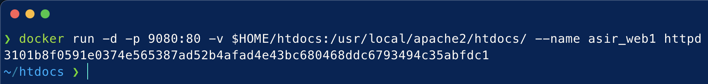
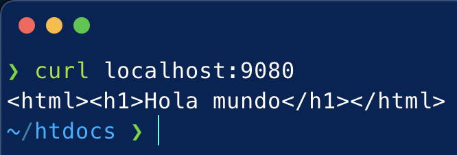

# Docker - Trabajando con volumenes
La siguiente práctica es una lista de tareas que tenéis que hacer.

Por cada tarea tenéis que ir poniendo los comandos utilizados y, brevemente, describir el proceso y como compruebas que se ha realizado lo pedido en un fichero (nombre "Readme.md") con formato markdown.

### a) Descarga la imagen `httpd` y comprueba que está en tu equipo.
Mediante el comando:
```console
docker pull httpd:latest
```
procederemos a descargarnos en nuestro equipo la última versión de la imagen `httpd`.

Una vez descargada, con el comando:
```console
docker images | grep 'httpd'
```
prodemos visualizar dicha imagen descargada.



### b) Crea un contenedor llamado `asir_httpd`, con el puerto `8000` de tu máquina mapeado al puerto `80` del contenedor y el directorio `htdocs` del contenedor montado en un directorio `local` elegido:
Mediante el comando:
```console
docker run -d -p 8000:80 -v $HOME/htdocs:/usr/local/apache2/htdocs/ --name asir_httpd httpd
```
procederemos a crear un contenedor en segundo plano nombrado `asir_httpd`, con el puerto `8000` del equipo mapeado al puerto `80` del contenedor y el directorio `htdocs` de dicho contenedor montado en el directorio local `$HOME/htdocs`.



### c) Realiza un `hola mundo` en html y comprueba que accedes desde el navegador:
Mediante el comando:
```console
echo "<html><h1>Hola mundo</h1></html>" > index.html
```
procederemos a crear nuestro archivo `index.html` que será mostrado por nuestro servidor web contenido en nuestro contenedor `asir_httpd`.

Una vez creado dicho archivo, con el comando:
```console
curl localhost:8000
```
podremos acceder al código fuente de dicho fichero `index.html`.



### d) Crea un contenedor `asir_web1` que use este mismo directorio para `htdocs` y el puerto `8000`:
Mediante el comando:
```console
docker run -d -p 9080:80 -v $HOME/htdocs:/usr/local/apache2/htdocs/ --name asir_web1 httpd
```
procederemos a crear un segundo contenedor en segundo plano nombrado `asir_web1`, con el puerto `9080` del equipo mapeado al puerto `80` del contenedor y el directorio `htdocs` de dicho contenedor montado en el directorio local `$HOME/htdocs`, el mismo que `asir_httpd`.



### e) Comprueba que los dos servidores 'sirven' la misma página:
Mediante el comando:
```console
curl localhost:9080
```
podremos visualizar el código fuente del archivo `index.html` del servidor web alojado en el contenedor `asir_web1`, el mismo archivo `index.html` alojado en el contendor `asir_httpd`.


