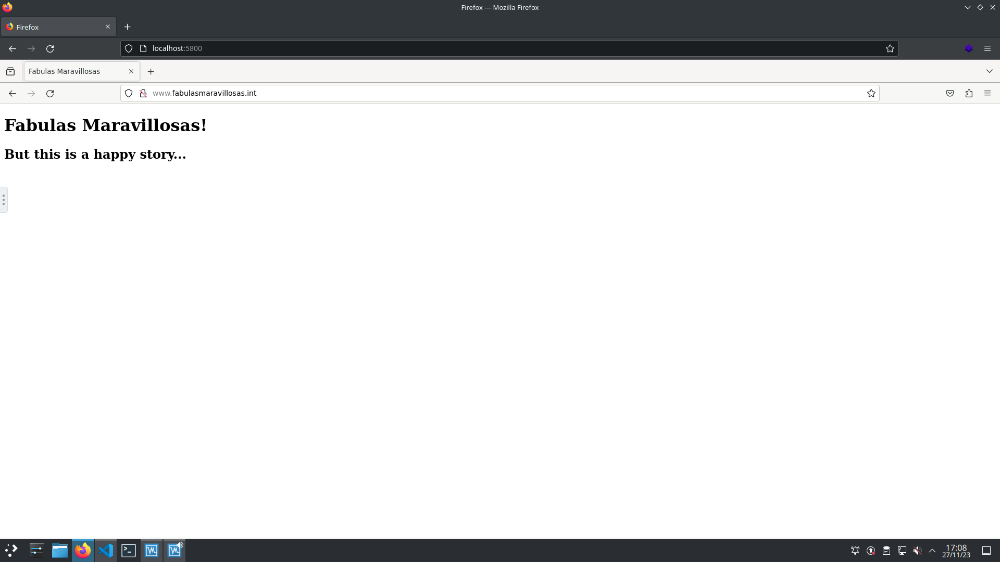
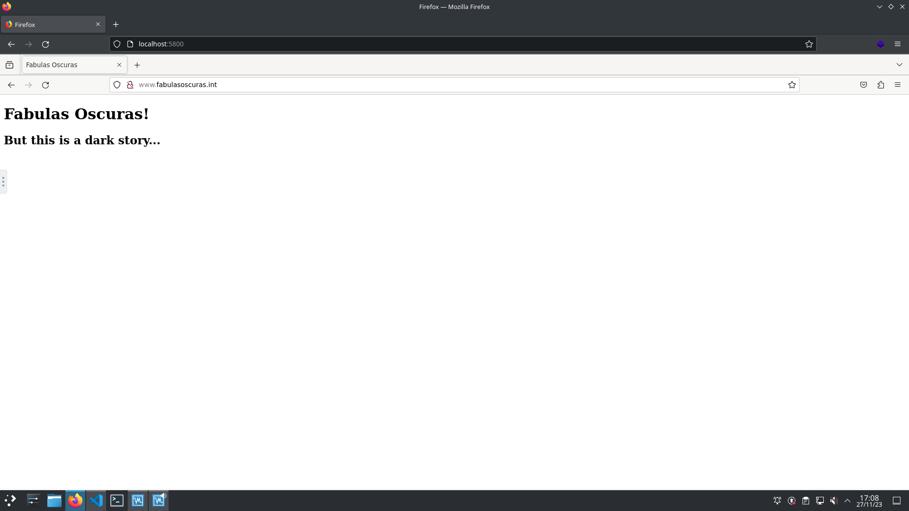

# Apache en Docker
## Configuración
### Paso 1
Instalamos las imágenes `docker`` de nuestros servicios necesarios:

*Apache*
```yaml
docker pull httpd:latest
```
*DNS*
```yaml
docker pull bind9:latest
```
*Firefox*
```yaml
docker pull jlesage/firefox
```
### Paso 2
Configuramos nuestro fichero `docker-compose.yaml`` con sus respectivos servicios docker:
```yaml
version: '3.9'

services:
  httpd1: # Servidor Apache
    container_name: httpd1
    image: httpd:latest
    working_dir: /usr/local/apache2/htdocs
    volumes:
      - /home/asir2/asir/github/sri/docker/httpd/htdocs/:/usr/local/apache2/htdocs
      - /home/asir2/asir/github/sri/docker/httpd/httpd.conf:/usr/local/apache2/conf/httpd.conf
    ports: 
      - '58080:80'
    expose:
      - '80'
    networks: 
      mynetwork: 
        ipv4_address: 172.28.0.80
    dns:
      - 172.28.0.53
    restart: on-failure

    dns: # Servidor DNS
    container_name: dns
    image: ubuntu/bind9:latest
    working_dir: /etc/bind
    volumes:
      - /home/asir2/asir/github/sri/docker/dns/bind/named.conf:/etc/bind/named.conf
      - /home/asir2/asir/github/sri/docker/dns/bind/named.conf.options:/etc/bind/named.conf.options
      - /home/asir2/asir/github/sri/docker/dns/bind/named.conf.local:/etc/bind/named.conf.local
      - /home/asir2/asir/github/sri/docker/dns/bind/named.conf.default-zones:/etc/bind/named.conf.default-zones
      - /home/asir2/asir/github/sri/docker/dns/lib/:/var/lib/bind/
    networks:
      mynetwork:
        ipv4_address: 172.28.0.53
    ports: 
      - '53:53/udp'
    expose:
      - '53/udp'
    restart: on-failure

    firefox:
    container_name: firefox
    image: jlesage/firefox
    ports:
      - "5800:5800"
    volumes:
      - "/home/asir2/asir/asir2/sri/firefox:/config:rw"
    networks:
      mynetwork:
        ipv4_address: 172.28.0.220
    environment:
      - "TZ=Europe/Madrid"
    dns:
      - 172.28.0.53
    
networks: # Red Servicios
  mynetwork:
    ipam:
      config:
        - subnet: 172.28.0.0/24
          gateway: 172.28.0.254
```
### Paso 3
Establecemos la configuración necesaria de cada servicio:

**Apache**

*httpd.conf*
```yaml
ServerRoot "/usr/local/apache2"

Listen 80

User www-data
Group www-data

<VirtualHost *:80>
    ServerName www.fabulasoscuras.int
    ServerAdmin webmaster@localhost
    DocumentRoot /usr/local/apache2/htdocs/fabulas_oscuras
</VirtualHost>

<VirtualHost *:80>
    ServerName www.fabulasmaravillosas.int
    ServerAdmin webmaster@localhost
    DocumentRoot /usr/local/apache2/htdocs/fabulas_maravillosas
</VirtualHost>

ServerName 172.28.0.80:80

<Directory />
    AllowOverride none
    Require all denied
</Directory>

DocumentRoot "/usr/local/apache2/htdocs"
<Directory "/usr/local/apache2/htdocs">

    Options Indexes FollowSymLinks
    AllowOverride None
    Require all granted

</Directory>

<IfModule dir_module>
    DirectoryIndex index.html
</IfModule>
```
*www.fabulasmaravillosas.int index.html*
```yaml
<!DOCTYPE html>
<html lang="en">
    <head>
        <meta charset="UTF-8">
        <title>Fabulas Maravillosas</title>
    </head>
    <body>
        <h1>Fabulas Maravillosas!</h1>
        <h2>But this is a happy story...</h2>
    </body>
</html>
```
*www.fabulasoscuras.int index.html*
```yaml
<!DOCTYPE html>
<html>
    <head>
        <meta charset="UTF-8">
        <title>Fabulas Oscuras</title>
    </head>
    <body>
        <h1>Fabulas Oscuras!</h1>
        <h2>But this is a dark story...</h2>
    </body>
</html>
```

**DNS**

*named.conf.local*
```yaml
zone "fabulasoscuras.int" {
	type master;
	file "/var/lib/bind/db.fabulasoscuras.int";
	allow-query {
		any;
		};
	};

zone "fabulasmaravillosas.int" {
	type master;
	file "/var/lib/bind/db.fabulasmaravillosas.int";
	allow-query {
		any;
		};
	};
```
*db.fabulasmaravillosas.int*
```yaml
$TTL 38400	; 10 hours 40 minutes
@		IN SOA	ns.fabulasmaravillosas.int. mario.fabulasmaravillosas.int. (
				10000002   ; serial
				10800      ; refresh (3 hours)
				3600       ; retry (1 hour)
				604800     ; expire (1 week)
				38400      ; minimum (10 hours 40 minutes)
				)
; Server name
@		    IN      NS	    ns.fabulasmaravillosas.int.
; Addresses
ns			IN		A		172.28.0.53
www         IN      A       172.28.0.80
```
*db.fabulasoscuras.int*
```yaml
$TTL 38400	; 10 hours 40 minutes
@		IN SOA	ns.fabulasoscuras.int. mario.fabulasoscuras.int. (
				10000002   ; serial
				10800      ; refresh (3 hours)
				3600       ; retry (1 hour)
				604800     ; expire (1 week)
				38400      ; minimum (10 hours 40 minutes)
				)
; Server name
@		    IN      NS	    ns.fabulasoscuras.int.
; Addresses
ns			IN		A		172.28.0.53
www         IN      A       172.28.0.80
```
## Comprobación
### Paso 1
Mediante el comando:
```yaml
docker compose up -d
```
levantamos nuestros servicios docker y en nuestro navegador local ingresamos la siguiente url:
```yaml
localhost:5800
```
### Paso 2
Una vez dentro del navegado Firefox en Docker, ingresamos la url de nuestra página web a visualizar:

**www.fabulasmaravillosas.int**
```yaml
http://www.fabulasmaravillosas.int
```

**www.fabulasoscuras.int**
```yaml
http://www.fabulasoscuras.int
```

